# 🎲 Monte Carlo Algorithms - Data Analytics Lesson Plan

> A comprehensive, multi-tiered educational framework for teaching Monte Carlo algorithms in data analytics, designed to accommodate diverse student backgrounds and learning objectives.

## 📊 Project Overview

This project delivers a structured learning experience for understanding Monte Carlo algorithms with multiple learning paths tailored to different skill levels, from beginners to advanced practitioners. The curriculum incorporates cutting-edge research (2024-2025), practical applications, and sentiment analysis to continuously improve teaching effectiveness.

### 🧠 Project Architecture

```mermaid
mindmap
  root((Monte Carlo\nCurriculum))
    (Research)
      [2024-2025 Papers]
      [Industry Applications]
      [Software & Tools]
    (Learning Paths)
      [Easy Path 🟢]
      [Medium Path 🟡]
      [Hard Path 🔴]
    (Topics)
      [Fundamentals]
      [Simulation Techniques]
      [Applications]
      [Advanced Methods]
    (Analytics)
      [Sentiment Analysis]
      [Engagement Metrics]
      [Learning Outcomes]
    (Implementation)
      [React/Vite Frontend]
      [Data Visualizations]
      [Interactive Examples]
```

## 📂 Repository Structure

## 🚀 Learning Paths

| Path Level | Target Audience | Prerequisites | Focus Areas |
|------------|-----------------|---------------|-------------|
| 🟢 **Easy** | Beginners | Basic probability | Intuitive understanding, guided exercises |
| 🟡 **Medium** | Intermediate | Programming experience | Applied techniques, real-world problems |
| 🔴 **Hard** | Advanced | Strong stats & programming | Cutting-edge methods, research-oriented |

## 📈 Project Timeline

## ✅ Development Checklist

### Research Component
- [x] Create research directory structure
- [x] Compile 2024-2025 papers and resources
- [ ] Categorize research by topic relevance
- [ ] Create annotated bibliography
- [ ] Develop research summary for instructors

### Curriculum Development
- [x] Define core topics and learning objectives
- [x] Create learning path structures (Easy, Medium, Hard)
- [ ] Develop detailed lesson plans for each path
- [ ] Create interactive exercises and assignments
- [ ] Design assessment methodologies

### Technical Implementation (React/Vite)
- [ ] Set up development environment
- [ ] Design component architecture
- [ ] Implement interactive visualizations
- [ ] Develop user authentication
- [ ] Create adaptive learning features

### Analytics Framework
- [x] Design sentiment analysis methodology
- [ ] Implement feedback collection mechanisms
- [ ] Develop dashboard for instructors
- [ ] Create automated reporting system
- [ ] Test with sample data

## 🛠️ Tech Stack (Planned)

## 📞 Contact

For questions or suggestions regarding this curriculum, please contact the development team.

---

**Monte Carlo Algorithms - Data Analytics Lesson Plan**  
Copyright © 2025

