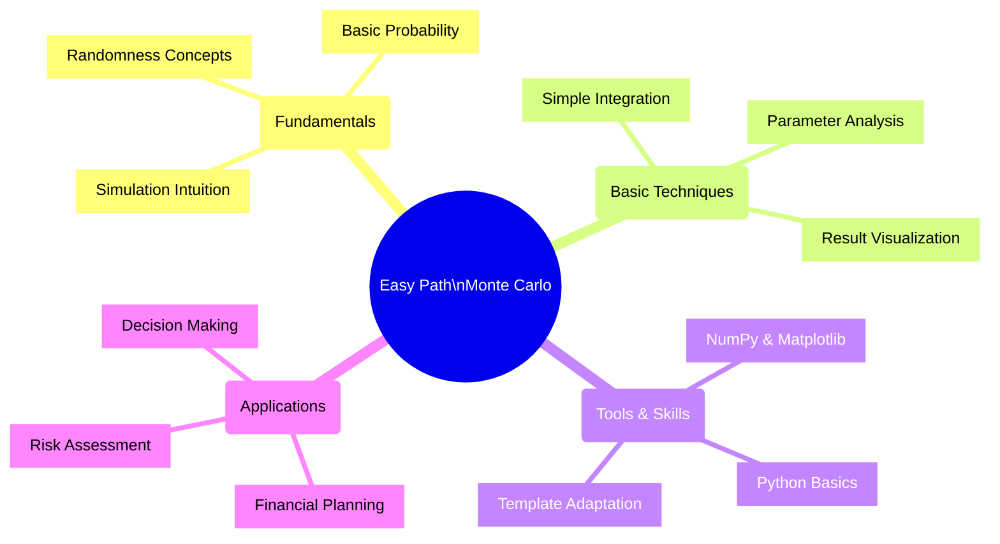
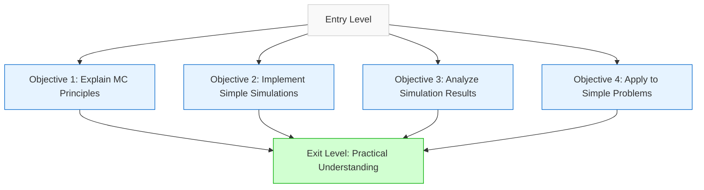
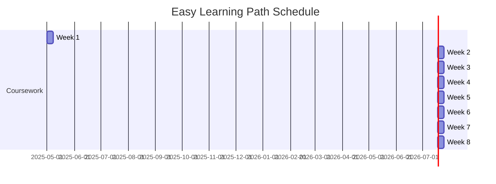
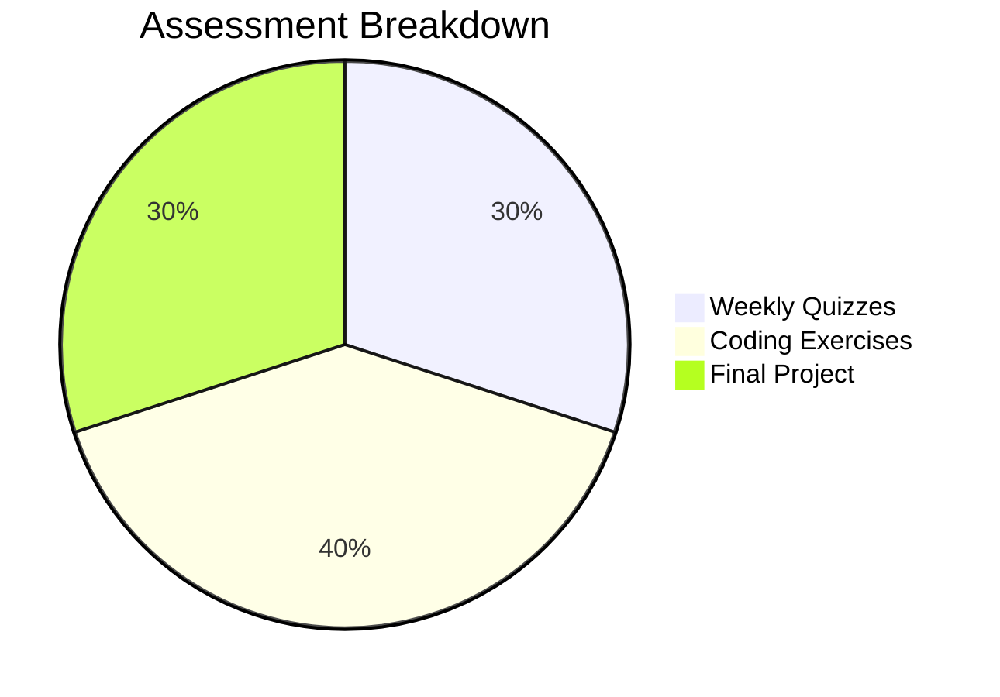

# 🟢 Monte Carlo Algorithms - Easy Learning Path

> This learning path is designed for beginners with limited programming and statistics background. It focuses on building fundamental understanding through simplified examples and guided hands-on activities.

## 🗺️ Path Overview

## 🎓 Prerequisites

| Prerequisite | Description | Learning Resources |
|--------------|-------------|--------------------|
| Basic Probability | High school level understanding of probability | [Khan Academy Probability](https://www.khanacademy.org/math/statistics-probability) |
| Programming Fundamentals | Basic syntax and concepts | [Python for Everybody](https://www.py4e.com/) |
| Simple Statistics | Mean, median, standard deviation | [Basic Statistics Tutorials](https://www.statmethods.net/stats/descriptives.html) |

## 🏆 Learning Objectives

By the end of this path, students will be able to:
1. **Explain** the basic principles of Monte Carlo methods in everyday language
2. **Implement** simple Monte Carlo simulations using provided templates
3. **Analyze** the results of basic Monte Carlo simulations
4. **Apply** Monte Carlo methods to solve simple real-world problems

## 📅 Weekly Curriculum

### Week 1: 🌟 Introduction to Monte Carlo Methods

| Session | Topics | Activities | Resources |
|---------|--------|------------|-----------|
| Lecture 1 | Randomness concepts, History of MC | Interactive demo: coin flips and dice | Slide deck, Historical videos |
| Lecture 2 | Intuition behind MC methods | Estimate π using random dots | Interactive simulation |
| Lab | First Monte Carlo simulation | Step-by-step guided coding | Templated Python notebooks |
| Assignment | Modified template to solve a new problem | Calculate area of an irregular shape | Starter code, visual guides |

### Week 2: 🌀 Probability Fundamentals for Monte Carlo

| Session | Topics | Activities | Resources |
|---------|--------|------------|-----------|
| Lecture 1 | Review of basic probability | Interactive probability games | Visual probability tools |
| Lecture 2 | Random variables and distributions | Visualizing different distributions | Interactive plots |
| Lab | Generating and sampling random numbers | NumPy random functions exploration | Guided Python exercises |
| Assignment | Create visualizations of random samples | Compare different distributions | Visualization templates |

### Week 3: 🎲 Basic Monte Carlo Simulation

| Session | Topics | Activities | Resources |
|---------|--------|------------|-----------|
| Lecture 1 | Building simple simulations | Real-time simulation building | Live coding demo |
| Lecture 2 | Understanding parameters and results | Parameter sensitivity analysis | Interactive parameter tools |
| Lab | Dice game and coin flip simulations | Build gambling simulations | Step-by-step tutorials |
| Assignment | Create a simple board game simulator | Analyze win probabilities | Game rules, starter code |

### Week 4: 📈 Introduction to Monte Carlo Integration

| Session | Topics | Activities | Resources |
|---------|--------|------------|-----------|
| Lecture 1 | Numerical integration concepts | Visual explanation of integration | Interactive graphics |
| Lecture 2 | Monte Carlo approach to integration | Comparison with traditional methods | Method comparison tool |
| Lab | Estimating areas of irregular shapes | Calculate areas using MC sampling | Shape templates |
| Assignment | Integrate a complex 2D function | Compare accuracy vs. sample size | Function visualizer |

### Week 5: 💰 Simple Applications

| Session | Topics | Activities | Resources |
|---------|--------|------------|-----------|
| Lecture 1 | Financial planning with Monte Carlo | Retirement calculator demo | Financial planning tools |
| Lecture 2 | Basic risk assessment | Insurance and investment scenarios | Case study materials |
| Lab | Building a basic retirement calculator | Step-by-step development | Financial templates |
| Assignment | Personal financial scenario analysis | Apply MC to personal finance question | Scenario guidelines |

### Week 6: 💻 Python Tools for Monte Carlo

| Session | Topics | Activities | Resources |
|---------|--------|------------|-----------|
| Lecture 1 | NumPy for random number generation | NumPy functions overview | NumPy cheatsheet |
| Lecture 2 | Visualization with Matplotlib | Creating effective MC visualizations | Plot gallery examples |
| Lab | Creating visualization dashboards | Interactive plotting workshop | Dashboard templates |
| Assignment | Create an animated Monte Carlo process | Show convergence visually | Animation starter code |

### Week 7: 🧰 Simple Decision-Making with Monte Carlo

| Session | Topics | Activities | Resources |
|---------|--------|------------|-----------|
| Lecture 1 | Modeling basic decisions | Decision tree construction | Decision modeling tools |
| Lecture 2 | Expected value calculations | Risk vs. reward analysis | Expected value calculator |
| Lab | Insurance purchase decision model | Should I buy insurance? | Decision model template |
| Assignment | Create a simple decision support tool | Personal decision case study | Framework code |

### Week 8: 🌐 Final Project

| Session | Topics | Activities | Resources |
|---------|--------|------------|-----------|
| Workshop 1 | Project planning and selection | Choose from project options | Project guidelines |
| Workshop 2 | Implementation strategies | Work on implementation challenges | Office hours support |
| Review | Peer feedback and improvements | Group review sessions | Feedback templates |
| Presentation | Project demos and explanations | Present findings to class | Presentation template |

**Project Options:**
- Weather prediction simulation
- Simple stock portfolio simulation
- Basic game strategy optimization

## 📊 Assessment Methods

| Assessment | Weight | Format | Frequency | Focus |
|------------|--------|--------|-----------|-------|
| Weekly Quizzes | 30% | Multiple choice + short answer | Weekly | Conceptual understanding |
| Coding Exercises | 40% | Python notebooks | Weekly | Practical implementation |
| Final Project | 30% | Implementation + presentation | End of course | Application & synthesis |

## 📖 Resources

- **Course Materials:** Custom-developed with simplified explanations
- **Visual Aids:** Animations and interactive visualizations
- **Code Templates:** Step-by-step implementation guides
- **Support:** Dedicated online forum and office hours

## ✅ Learning Path Development Checklist

- [x] Define learning objectives and prerequisites
- [x] Create weekly curriculum outline
- [x] Map topics to appropriate difficulty level
- [ ] Develop detailed lesson plans for each week
- [ ] Create code templates for exercises
- [ ] Develop visual aids and animations
- [ ] Create assessment instruments
- [ ] Prepare project guidelines and templates
- [ ] Design interactive examples for key concepts
- [ ] Create student resource library

---

**Monte Carlo Algorithms - Data Analytics Curriculum**  
Easy Learning Path • April 2025

