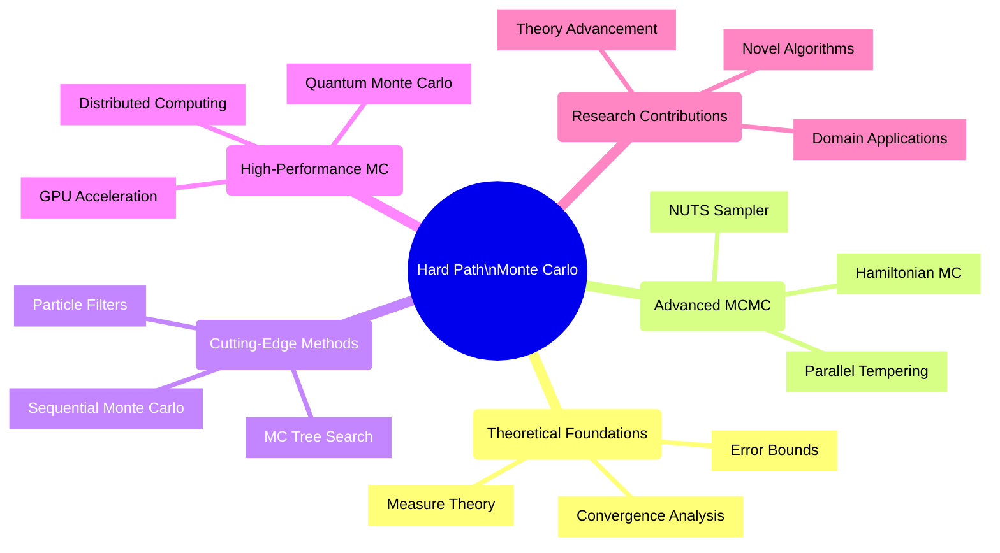
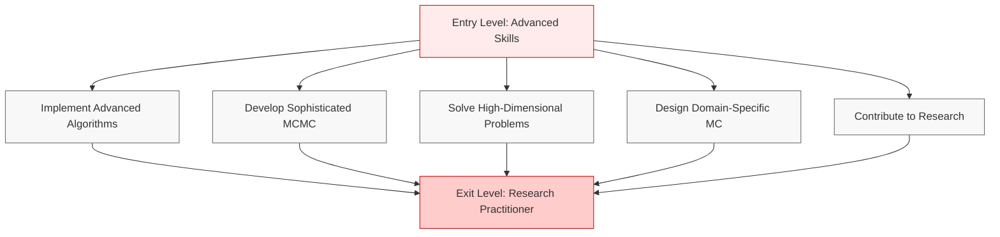
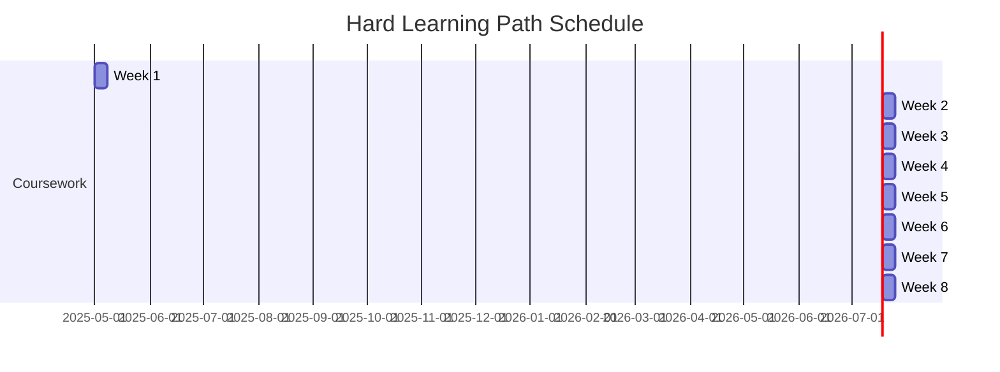
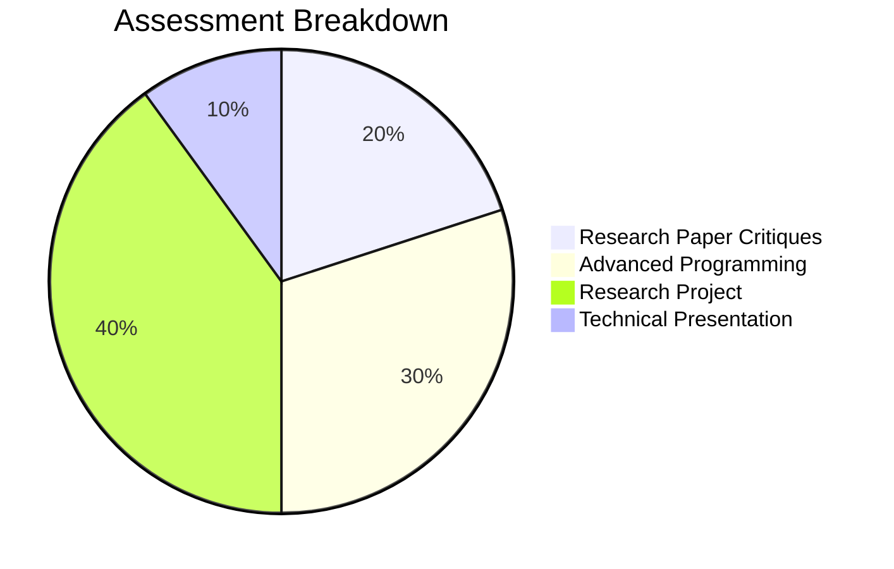
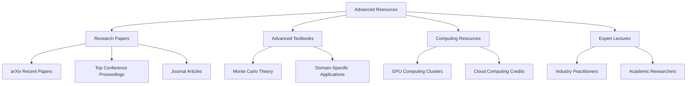
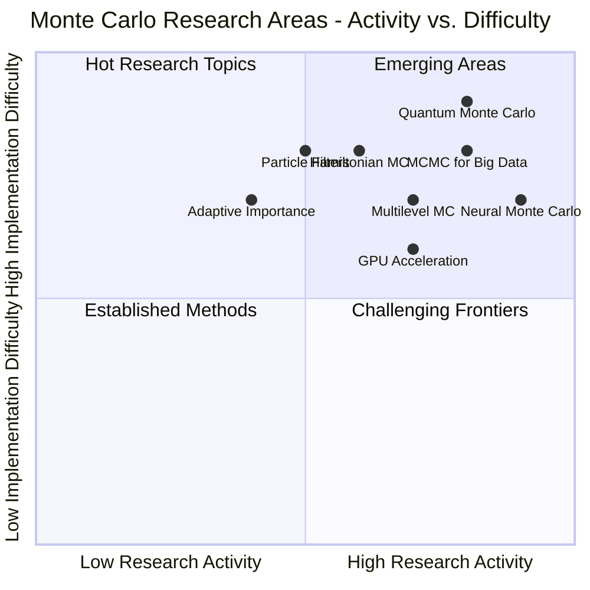

# 🔴 Monte Carlo Algorithms - Hard Learning Path

> This advanced learning path is designed for students with strong programming and statistics foundations. It focuses on cutting-edge techniques, theoretical underpinnings, and complex applications of Monte Carlo methods at the research frontier.

## 🗺️ Path Overview

## 🎓 Prerequisites

| Prerequisite | Description | Learning Resources |
|--------------|-------------|--------------------|
| Advanced Probability & Statistics | Measure theory, stochastic processes | [Probability Theory: The Logic of Science](https://bayes.wustl.edu/etj/prob/book.pdf) |
| Numerical Computing | High-performance scientific programming | [Numerical Recipes](http://numerical.recipes/) |
| Advanced Math | Graduate-level calculus, linear algebra | [MIT OCW Mathematics](https://ocw.mit.edu/courses/mathematics/) |
| Optimization & ML | Advanced algorithms, computational techniques | [Convex Optimization](https://web.stanford.edu/~boyd/cvxbook/) |

## 🏆 Learning Objectives

By the end of this path, students will be able to:
1. **Implement and analyze** advanced Monte Carlo algorithms with rigorous theoretical justification
2. **Develop** sophisticated MCMC samplers for complex, high-dimensional problems
3. **Apply** Monte Carlo methods to challenging high-dimensional and computationally intensive problems
4. **Design and optimize** Monte Carlo algorithms for specific domains requiring specialized approaches
5. **Contribute** to the state-of-the-art in Monte Carlo methodology through novel research

## 📅 Weekly Curriculum

### Week 1: 📖 Advanced Theory of Monte Carlo Methods

| Session | Topics | Activities | Resources |
|---------|--------|------------|-----------|
| Lecture 1 | Measure-theoretic foundations | Mathematical proofs & derivations | Research papers on MC theory |
| Lecture 2 | Convergence & error analysis | Theoretical guarantees examination | Advanced probability texts |
| Lab | Specialized RNG implementation | Implement cryptographically secure PRNGs | Algorithm specifications |
| Assignment | Theoretical analysis of convergence rates | Derive bounds for specific MC methods | Mathematical framework |

### Week 2: 💡 Sophisticated Variance Reduction

| Session | Topics | Activities | Resources |
|---------|--------|------------|-----------|
| Lecture 1 | Control variates with autodiff | Gradient-based optimization of estimators | JAX/PyTorch tutorials |
| Lecture 2 | Multilevel Monte Carlo | Error vs. computational cost analysis | Original MLMC papers |
| Lab | Adaptive importance sampling | Dynamic proposal distribution updates | Implementation guides |
| Assignment | Compare advanced variance reduction | Benchmark on challenging integrals | Evaluation metrics |

### Week 3: ⛰️ Advanced Markov Chain Monte Carlo

| Session | Topics | Activities | Resources |
|---------|--------|------------|-----------|
| Lecture 1 | Hamiltonian Monte Carlo | Geometric interpretation & theory | Original HMC papers |
| Lecture 2 | NUTS & parallel tempering | Advanced sampling techniques | Stan/PyMC3 source code |
| Lab | HMC implementation workshop | From scratch implementation | Differential geometry reference |
| Assignment | Sample from pathological posteriors | Overcome multimodality challenges | Benchmark distributions |

### Week 4: 🚀 Sequential Monte Carlo and Particle Methods

| Session | Topics | Activities | Resources |
|---------|--------|------------|-----------|
| Lecture 1 | Particle filter theory | State-space models & filtering | Advanced filtering literature |
| Lecture 2 | Sequential methods with resampling | Combating degeneracy & sample impoverishment | Research implementations |
| Lab | Particle filter implementation | Real-time state estimation | Sensor fusion frameworks |
| Assignment | Particle MCMC for complex systems | State-space inference challenge | Evaluation framework |

### Week 5: 🎮 Monte Carlo Tree Search and Reinforcement Learning

| Session | Topics | Activities | Resources |
|---------|--------|------------|-----------|
| Lecture 1 | Advanced MCTS algorithms | Beyond vanilla UCT | DeepMind papers |
| Lecture 2 | Neural network integration | Self-play & policy distillation | AlphaZero architecture |
| Lab | MCTS for complex decision spaces | Implementation with neural guidance | Game environment APIs |
| Assignment | Build AlphaZero-style system | For custom game or decision problem | Deep RL frameworks |

### Week 6: 💻 Monte Carlo Methods for High-Performance Computing

| Session | Topics | Activities | Resources |
|---------|--------|------------|-----------|
| Lecture 1 | GPU acceleration fundamentals | Memory hierarchy & SIMD | CUDA/OpenCL documentation |
| Lecture 2 | Distributed MC algorithms | Communication patterns & efficiency | MPI/Ray/Dask frameworks |
| Lab | GPU-accelerated MC workshop | CUDA/OpenCL programming | Developer tools |
| Assignment | Scale simulation to multi-GPU/node | Billion+ sample simulation | Cloud computing resources |

### Week 7: 🔬 Cutting-Edge Applications

| Session | Topics | Activities | Resources |
|---------|--------|------------|-----------|
| Lecture 1 | Quantum Monte Carlo | Path integral & variational MC | Physics literature |
| Lecture 2 | Advanced domain applications | Molecular dynamics, climate, finance | Domain-specific papers |
| Lab | Domain-specific simulation | Choose specialized application | Field-specific libraries |
| Assignment | Advanced application challenge | Novel application implementation | Research implementation |

### Week 8: 🦼 Research Project

| Session | Topics | Activities | Resources |
|---------|--------|------------|-----------|
| Workshop 1 | Research direction & literature review | Define novel contribution | Literature search tools |
| Workshop 2 | Implementation planning & methodology | Research methods development | Experimental design |
| Lab Hours | Independent research & mentoring | One-on-one research guidance | Faculty/industry mentors |
| Presentation | Research symposium | Present findings to peers/faculty | Scientific presentation guide |

**Project Options:**
- Developing new Monte Carlo algorithms with theoretical guarantees
- Improving existing methods for specific challenging domains
- Theoretical analysis of Monte Carlo convergence properties
- Advanced application development at research frontier

## 📊 Assessment Methods

| Assessment | Weight | Format | Frequency | Focus |
|------------|--------|--------|-----------|-------|
| Research Paper Critiques | 20% | Written analysis & critique | Bi-weekly | Critical evaluation of methods |
| Advanced Programming | 30% | Implementation & analysis | Weekly | Algorithm implementation |
| Research Project | 40% | Original contribution & paper | End of course | Novel research |
| Technical Presentation | 10% | Conference-style talk | Final week | Communication of results |

## 📖 Resources

- **Research Papers**: Current papers from NeurIPS, ICML, AISTATS, etc.
- **Advanced Textbooks**: Specialized theoretical texts on MC methods
- **Expert Lectures**: Guest speakers from academia and industry
- **Computing Resources**: Access to high-performance computing

## ✅ Learning Path Development Checklist

- [x] Define research-level learning objectives
- [x] Create advanced curriculum outline
- [x] Map topics to appropriate research areas
- [ ] Recruit expert lecturers and mentors
- [ ] Develop advanced mathematical materials
- [ ] Create challenging implementation assignments
- [ ] Select key research papers for reading list
- [ ] Prepare research project guidelines
- [ ] Arrange access to computing resources
- [ ] Develop assessment rubrics for research-level work

## 🌐 Research Areas Map

---

**Monte Carlo Algorithms - Data Analytics Curriculum**  
Hard Learning Path • April 2025

