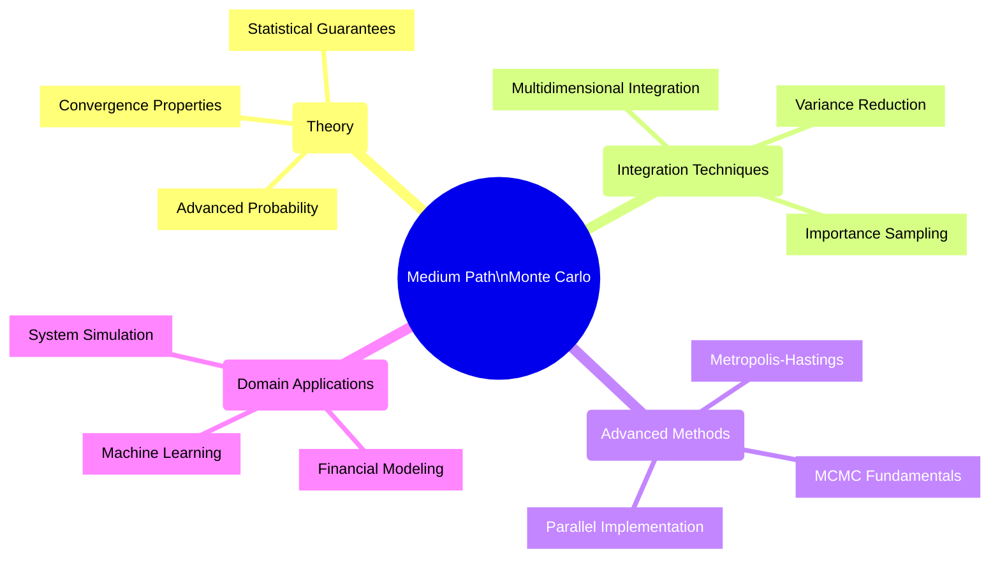
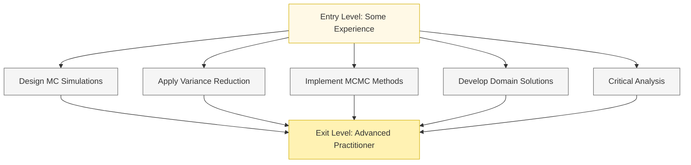
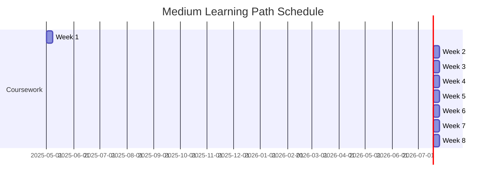
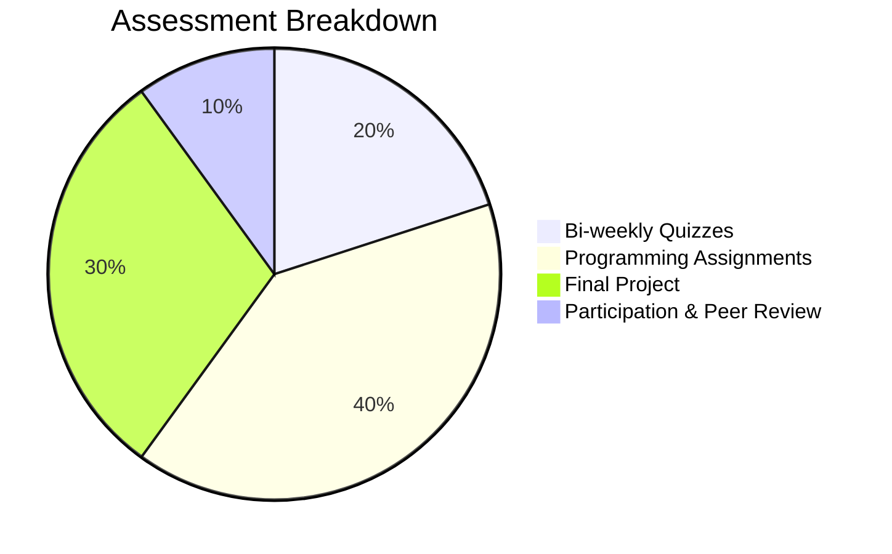
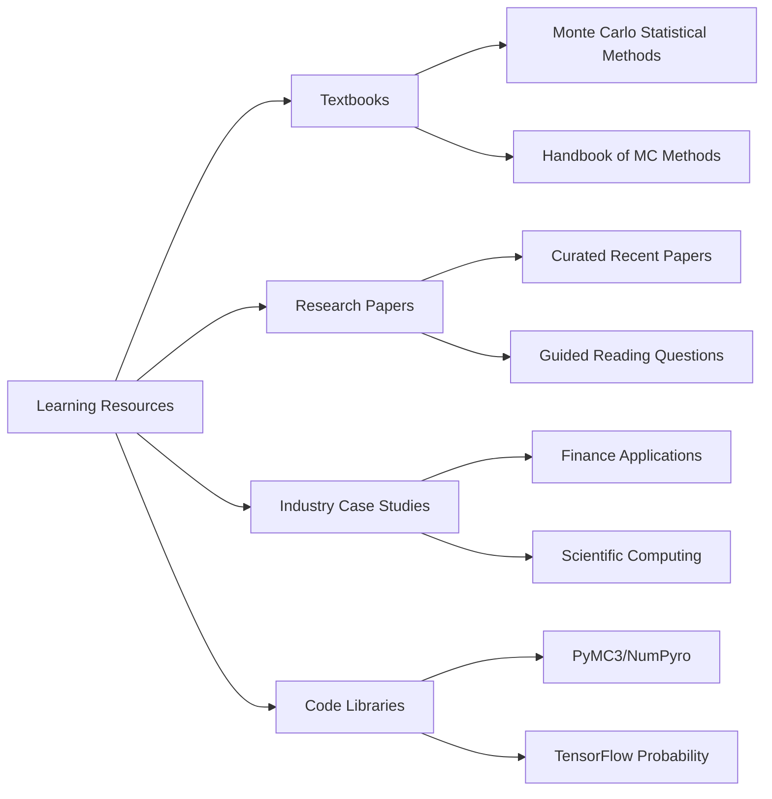

# 🟡 Monte Carlo Algorithms - Medium Learning Path

> This learning path is designed for students with some experience in data analysis or programming. It builds on fundamental concepts and introduces more sophisticated techniques and applications.

## 🗺️ Path Overview

## 🎓 Prerequisites

| Prerequisite | Description | Learning Resources |
|--------------|-------------|--------------------|
| Probability & Statistics | Working knowledge of distributions, hypothesis testing | [StatQuest with Josh Starmer](https://www.youtube.com/c/joshstarmer) |
| Programming Skills | Intermediate Python or R | [Python for Data Science Handbook](https://jakevdp.github.io/PythonDataScienceHandbook/) |
| Calculus Concepts | Integrals, gradients, multivariable calculus | [3Blue1Brown Calculus Series](https://www.youtube.com/playlist?list=PLZHQObOWTQDMsr9K-rj53DwVRMYO3t5Yr) |
| Data Analysis | Experience with data manipulation and visualization | [Kaggle Learn](https://www.kaggle.com/learn/overview) |

## 🏆 Learning Objectives 

By the end of this path, students will be able to:
1. **Design and implement** intermediate Monte Carlo simulations
2. **Apply** variance reduction techniques to improve simulation efficiency
3. **Understand and implement** basic Markov Chain Monte Carlo (MCMC) methods
4. **Develop** Monte Carlo solutions for business and scientific problems
5. **Critically analyze** the limitations and strengths of different Monte Carlo approaches

## 📅 Weekly Curriculum

### Week 1: 📖 Monte Carlo Theory and Foundations

| Session | Topics | Activities | Resources |
|---------|--------|------------|-----------|
| Lecture 1 | Probability theory for MC methods | Interactive theorem demonstrations | Advanced probability concepts |
| Lecture 2 | Random number generation | PRNG vs QRNG comparisons | Statistical testing guides |
| Lab | Implementing different RNGs | Mersenne Twister & Sobol sequence | Implementation tutorial |
| Assignment | RNG quality analysis | Statistical tests for randomness | Test suite & benchmarks |

### Week 2: 📊 Advanced Monte Carlo Integration

| Session | Topics | Activities | Resources |
|---------|--------|------------|-----------|
| Lecture 1 | Multidimensional integration challenges | Curse of dimensionality demonstration | Mathematical foundations |
| Lecture 2 | Variance reduction techniques | Comparison of efficiency improvements | Research paper summaries |
| Lab | Implementing importance sampling | Step-by-step implementation | Code templates |
| Assignment | Compare integration techniques | Benchmark different approaches | Evaluation framework |

### Week 3: 🎯 Monte Carlo Simulation Applications

| Session | Topics | Activities | Resources |
|---------|--------|------------|-----------|
| Lecture 1 | System modeling principles | From concept to simulation | Modeling guides |
| Lecture 2 | Discrete-event & time-stepping | Queue simulation workshop | Simulation libraries |
| Lab | Building a customer service queue | Complete implementation | SimPy tutorial |
| Assignment | Extended queue optimization | Apply MC to improve service | Case study materials |

### Week 4: ⛰️ Introduction to Markov Chain Monte Carlo

| Session | Topics | Activities | Resources |
|---------|--------|------------|-----------|
| Lecture 1 | Markov chain fundamentals | Visualizing Markov processes | Interactive Markov demos |
| Lecture 2 | Metropolis-Hastings algorithm | Step-by-step algorithm walkthrough | Algorithm visualization |
| Lab | Implementing a basic MH sampler | Guided coding session | PyMC3 tutorial |
| Assignment | MCMC for parameter estimation | Apply to statistical problem | Problem set & data |

### Week 5: 💰 Monte Carlo Methods in Finance

| Session | Topics | Activities | Resources |
|---------|--------|------------|-----------|
| Lecture 1 | Portfolio optimization theory | Modern portfolio theory overview | Financial theory resources |
| Lecture 2 | Option pricing & risk assessment | Black-Scholes vs. Monte Carlo | Options modeling tutorial |
| Lab | Stock portfolio simulator | Risk-return optimization | Financial data APIs |
| Assignment | Investment strategy evaluation | Backtest with historical data | Strategy evaluation framework |

### Week 6: 🤖 Monte Carlo in Machine Learning

| Session | Topics | Activities | Resources |
|---------|--------|------------|-----------|
| Lecture 1 | Bayesian inference foundations | Bayes theorem & posterior sampling | Bayesian statistics primer |
| Lecture 2 | Bootstrapping & cross-validation | Uncertainty quantification methods | ML validation techniques |
| Lab | Bayesian parameter estimation | MCMC for neural network params | PyTorch/TensorFlow guide |
| Assignment | ML model uncertainty analysis | MC dropout implementation | Uncertainty visualization tools |

### Week 7: 💡 Parallel Monte Carlo Implementation

| Session | Topics | Activities | Resources |
|---------|--------|------------|-----------|
| Lecture 1 | Parallelization strategies | Embarrassingly parallel MC | Parallelization patterns |
| Lecture 2 | Vectorization & scaling | Performance optimization techniques | Profiling tools overview |
| Lab | Implementing parallel MC | Using multiprocessing & NumPy | Code optimization guide |
| Assignment | Scale a simulation to handle large problems | Performance benchmarking | Optimization checklist |

### Week 8: 🌐 Advanced Project

| Session | Topics | Activities | Resources |
|---------|--------|------------|-----------|
| Workshop 1 | Project planning & scoping | Define project objectives & approach | Project templates |
| Workshop 2 | Implementation guidance | Technical approach deep-dives | Reference implementations |
| Milestone | Progress check & feedback | Peer review session | Feedback framework |
| Presentation | Project demos & technical review | Present findings & implementation | Rubric & guidelines |

**Project Options:**
- Supply chain optimization simulation
- Advanced financial risk modeling
- Scientific simulation (physics, biology, chemistry)
- Machine learning model optimization with MC methods

## 📊 Assessment Methods

| Assessment | Weight | Format | Frequency | Focus |
|------------|--------|--------|-----------|-------|
| Bi-weekly Quizzes | 20% | Short answer & concept problems | Every two weeks | Theoretical understanding |
| Programming Assignments | 40% | Python/R implementations | Weekly | Applied techniques |
| Final Project | 30% | Implementation & technical report | End of course | Problem-solving & integration |
| Participation & Peer Review | 10% | Forum engagement & peer feedback | Ongoing | Collaboration & critical analysis |

## 📖 Resources

- **Textbooks**: Specialized resources on Monte Carlo methods
- **Research Papers**: Curated papers with guided readings
- **Industry Case Studies**: Real-world applications
- **Code Libraries**: Professional MC implementation resources

## ✅ Learning Path Development Checklist

- [x] Define learning objectives and prerequisites
- [x] Create weekly curriculum outline 
- [x] Map topics to appropriate difficulty level
- [ ] Develop detailed lecture materials 
- [ ] Create lab exercise templates
- [ ] Select and annotate research papers
- [ ] Develop programming assignments with solutions
- [ ] Prepare project guidelines and evaluation rubrics
- [ ] Create assessment instruments
- [ ] Develop resource library and code examples

---

**Monte Carlo Algorithms - Data Analytics Curriculum**  
Medium Learning Path • April 2025

