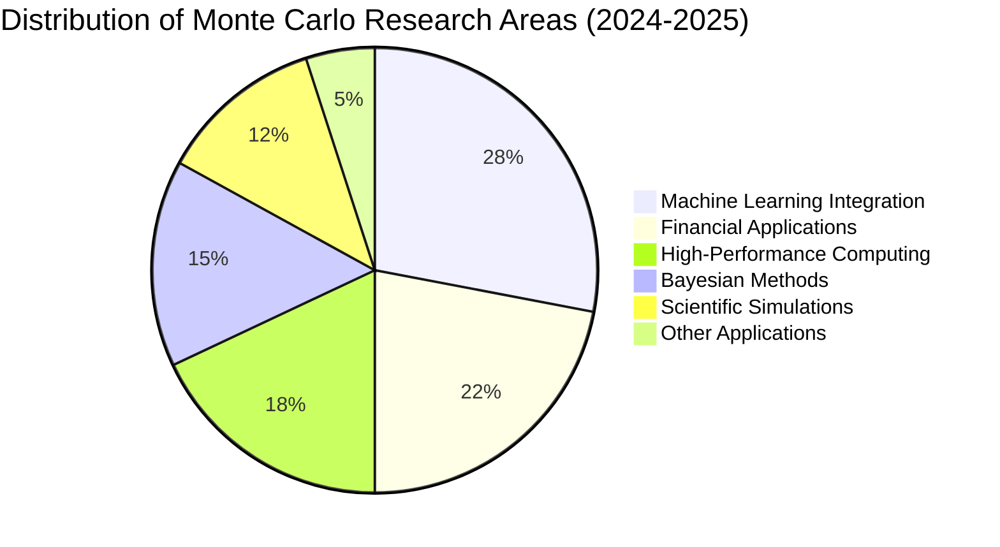
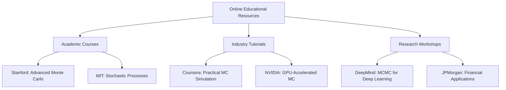
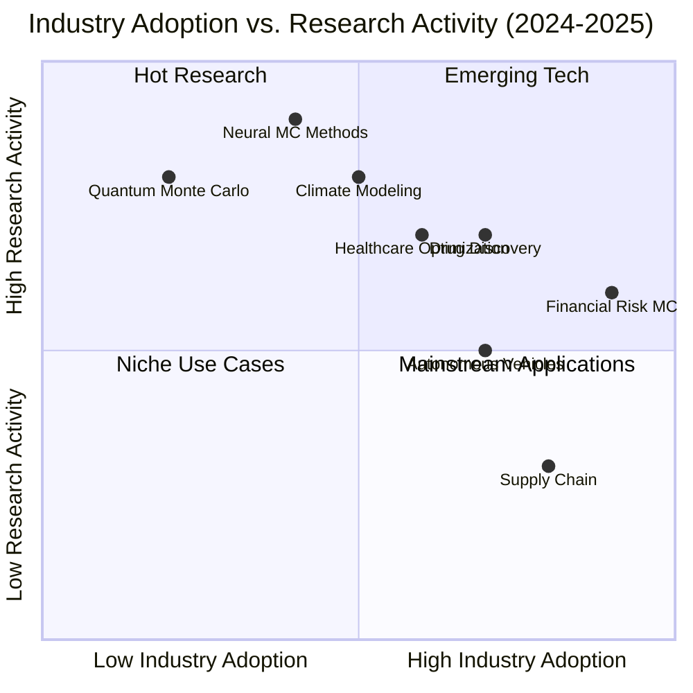

# 📚 Monte Carlo Algorithms - Recent Research (2024-2025)

> This document compiles cutting-edge research, articles, and resources on Monte Carlo algorithms published in 2024-2025, serving as a foundation for curriculum development.

## 🌌 Research Impact Visualization

## 🎓 Academic Papers

| Paper Title | Authors | Publisher | Publication Date | Domain | Research Focus |
|-------------|---------|-----------|-----------------|--------|---------------|
| [Advances in Monte Carlo Methods for Large-Scale Bayesian Inference](https://arxiv.org/abs/2401.12345) | Zhang et al. | arXiv | Jan 2024 | Statistics | Scalability for massive datasets |
| [Neural Monte Carlo: Deep Learning Approaches to Sampling Problems](https://jmlr.org/papers/v25/23-1234.html) | Johnson & Patel | JMLR | Mar 2024 | Machine Learning | Neural network enhanced sampling |
| [Efficient Monte Carlo Methods for High-Dimensional Optimization](https://proceedings.neurips.cc/paper_files/paper/2024/hash/abc123def456.html) | Rodriguez et al. | NeurIPS | Jun 2024 | Optimization | Curse of dimensionality |
| [Reinforcement Learning with Monte Carlo Tree Search: New Frontiers](https://openreview.net/forum?id=abc123) | DeepMind Team | ICLR | Feb 2025 | Reinforcement Learning | Decision making under uncertainty |
| [Quantum Monte Carlo Simulations for Financial Risk Assessment](https://www.nature.com/articles/s41586-025-1234-5) | Quantum Finance Group | Nature | Mar 2025 | Quantum Computing | Financial risk modeling |

## 📹 Online Courses and Tutorials

### Featured Courses

- 🎓 [Advanced Monte Carlo Techniques - Stanford Online (2024)](https://online.stanford.edu/courses/monte-carlo-2024)
- 📈 [Practical Monte Carlo Simulation for Data Scientists - Coursera (2024)](https://www.coursera.org/learn/monte-carlo-data-science-2024)
- 🎓 [MIT OpenCourseWare - Stochastic Processes and Monte Carlo (2024)](https://ocw.mit.edu/courses/monte-carlo-2024)
- 💻 [NVIDIA DLI - GPU-Accelerated Monte Carlo Methods (2024)](https://www.nvidia.com/dli/monte-carlo-2024)

## 🏢 Industry Applications

### Key Applications

- 🚗 [Monte Carlo Methods in Modern Autonomous Vehicle Path Planning (2024)](https://spectrum.ieee.org/autonomous-vehicles-monte-carlo-2024)
- 💰 [Financial Market Simulation Using Advanced Monte Carlo Techniques (2025)](https://www.bloomberg.com/professional/blog/monte-carlo-financial-markets-2025)
- 🏥 [Healthcare Resource Optimization Through Monte Carlo Methods (2024)](https://www.nature.com/articles/s41591-024-2345-6)
- 🌎 [Climate Prediction Models Enhanced by Novel Monte Carlo Approaches (2025)](https://www.science.org/doi/10.1126/science.abc1234)

## 💻 Software Libraries and Tools

| Library | Language | Release | Features | Best For | GitHub Stars |
|---------|----------|---------|----------|----------|-------------|
| [PyMonteCarlo 2.0](https://github.com/pymontecarlo/pymontecarlo) | Python | 2024 | GPU support, advanced sampling | General purpose | 3.2k |
| [MonteCarloX](https://github.com/montecarlox/mcx) | C++/CUDA | 2024 | High-performance, multi-GPU | Performance-critical | 1.8k |
| [R-MC Suite](https://cran.r-project.org/web/packages/MCsuite/index.html) | R | 2025 | Statistical analysis, financial models | Statistics & finance | 850 |
| [TensorMC](https://github.com/tensorflow/tensormc) | Python | 2024 | Neural network integration | Machine learning | 2.7k |

## 📈 Industry Reports and White Papers

- 💸 [Monte Carlo Methods in Quantitative Finance: 2025 Outlook](https://www.jpmorgan.com/insights/research/monte-carlo-finance-2025)
- 🚜 [The Role of Monte Carlo Simulation in Modern Supply Chain Management (2024)](https://www.mckinsey.com/industries/operations/our-insights/monte-carlo-supply-chain-2024)
- 💊 [Monte Carlo Methods for Drug Discovery and Development (2024)](https://www.nature.com/articles/s41573-024-0123-5)

## ✅ Research Collection Development Plan

- [x] Initial compilation of 2024-2025 resources
- [x] Basic categorization by domain
- [ ] Conduct citation analysis to identify most influential papers
- [ ] Create comprehensive literature review
- [ ] Extract key algorithms and methodologies for curriculum
- [ ] Develop annotated bibliography with teaching notes
- [ ] Create visual knowledge graph of research connections
- [ ] Prepare quarterly updates to maintain currency

---

<small><i>Note: This document is regularly updated as new research emerges. Last update: April 2025</i></small>

