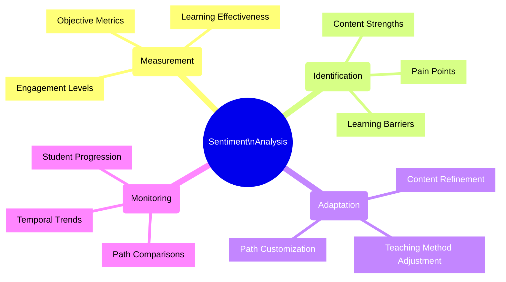
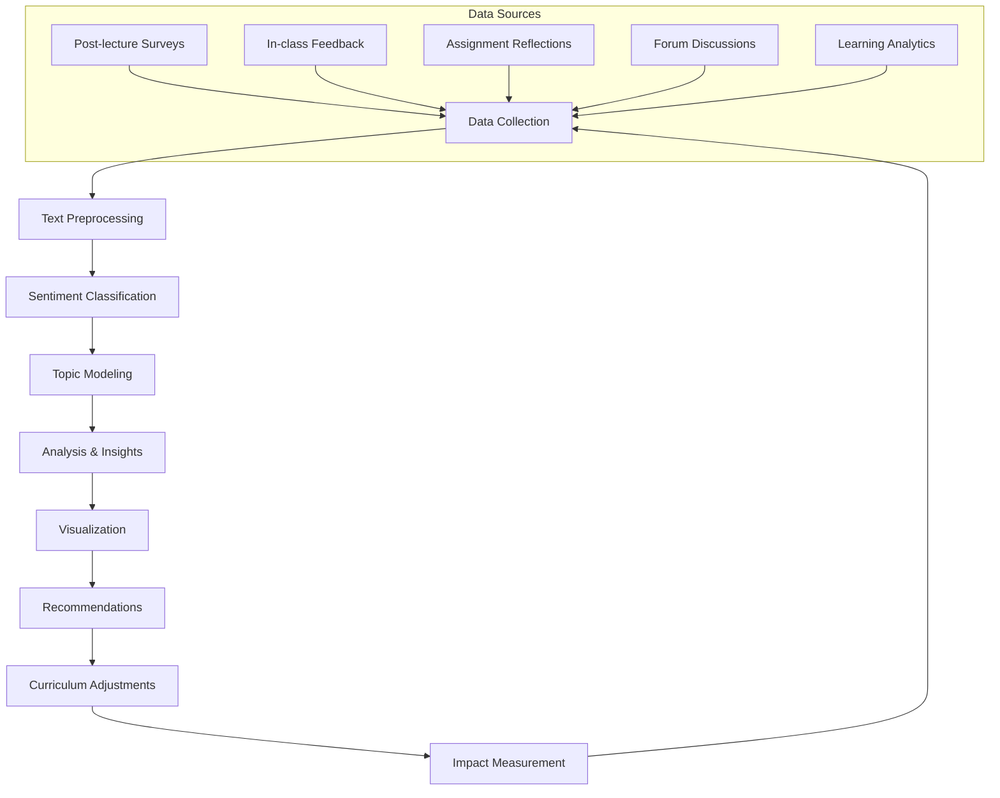
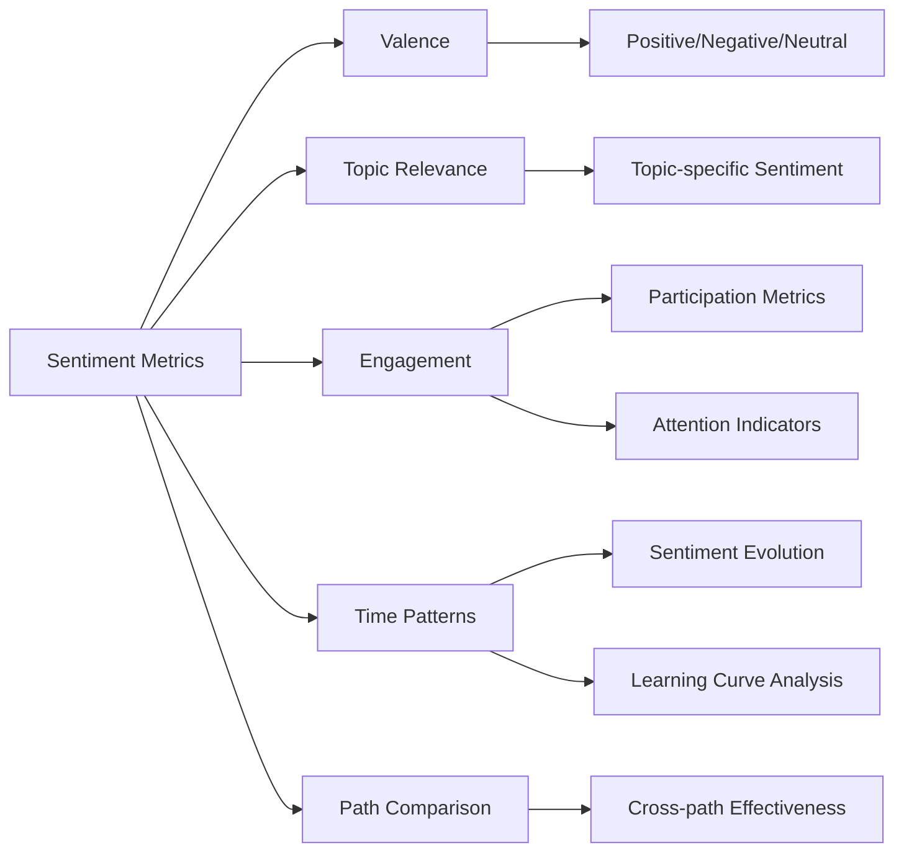
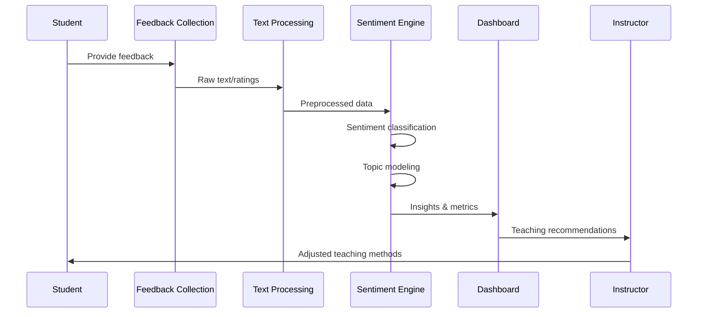
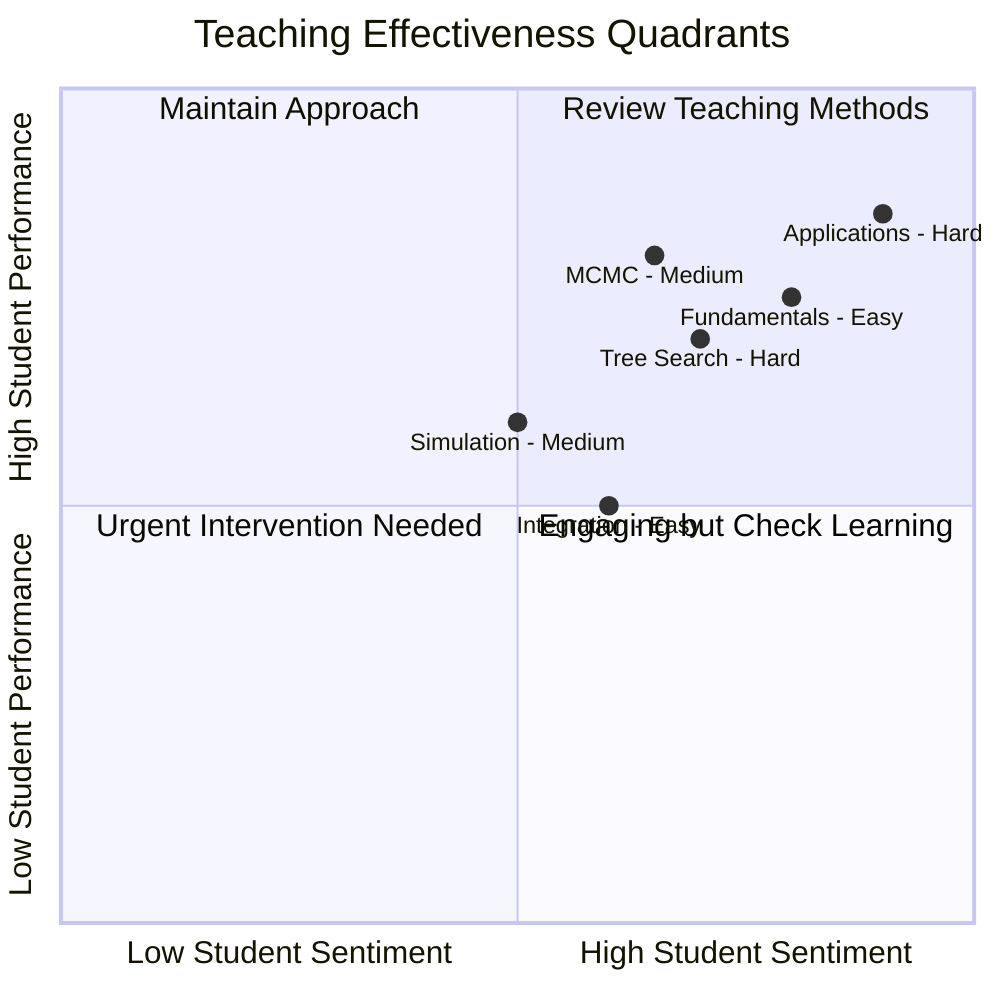
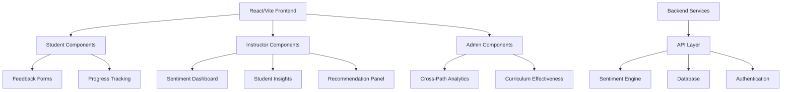

# 📊 Sentiment Analysis for Teaching Effectiveness

<div align="center">


</div>

> An intelligent analytics framework for measuring, understanding, and improving teaching effectiveness through sentiment analysis of student feedback and engagement metrics across all learning paths.

## 🌟 Purpose & Benefits



## 🛠️ Implementation Architecture



## 📈 Metrics Dashboard

```mermaid
xychart-beta
    title "Student Sentiment by Topic and Learning Path"
    x-axis ["Fundamentals", "Integration", "Simulation", "MCMC", "Applications"]
    y-axis "Sentiment Score" 0 --> 10
    bar [7.8, 6.5, 8.2, 5.4, 8.9] "Easy Path"
    bar [8.1, 7.2, 6.9, 7.5, 8.1] "Medium Path"
    bar [7.4, 8.3, 8.5, 8.7, 7.8] "Hard Path"
```

## 🔍 Implementation Components

### 1. 📝 Feedback Collection Systems

| Collection Method | Format | Frequency | Learning Paths | Implementation |
|-------------------|--------|-----------|----------------|----------------|
| Post-lecture Surveys | Structured + Free-form | Weekly | All | React form with Likert scales + text |
| In-class Feedback | Interactive polls | Per session | All | Live polling integration |
| Assignment Reflections | Guided questions | Per assignment | All | Markdown templates |
| Discussion Forums | Unstructured text | Continuous | All | Automated sentiment scraping |
| Course Evaluations | Comprehensive survey | End of module | All | Multi-section assessment |

### 2. 📊 Metrics Tracked



### 3. 🧠 Analysis Techniques

| Technique | Purpose | Implementation | Data Requirements |
|-----------|---------|----------------|-------------------|
| NLP Sentiment Analysis | Extract sentiment from text | BERT-based model | Free-form text feedback |
| Statistical Analysis | Quantify structured feedback | R/Python analysis | Likert scales, ratings |
| Temporal Trend Analysis | Track changes over time | Time-series modeling | Longitudinal data |
| Comparative Analysis | Compare across paths | Statistical testing | Multi-path data |
| Performance Correlation | Link sentiment to outcomes | Regression models | Grades + sentiment |

## ⚙️ Technical Implementation



### Pipeline Stages

1. **Data Collection**: Multi-channel feedback aggregation
2. **Text Preprocessing**: Cleaning, normalization, tokenization
3. **Sentiment Classification**: BERT-based sentiment scoring
4. **Topic Modeling**: LDA to associate sentiment with specific topics
5. **Visualization**: Interactive dashboards with drill-down capabilities
6. **Recommendation Engine**: AI-driven teaching improvement suggestions

## 👨‍🏫 Instructor Dashboard



## 📋 Development Plan & Checklist

- [x] Define analytics requirements and metrics
- [x] Design feedback collection methodology
- [ ] Create sentiment analysis architecture
- [ ] Develop feedback collection instruments
  - [ ] Survey templates
  - [ ] In-class feedback mechanisms
  - [ ] Assignment reflection components
  - [ ] Forum sentiment trackers
- [ ] Implement text processing pipeline
  - [ ] Text cleaning and normalization
  - [ ] Tokenization and vectorization
- [ ] Train/configure sentiment classification models
  - [ ] Fine-tune BERT for educational context
  - [ ] Develop topic-specific classifiers
- [ ] Create visualization dashboards
  - [ ] Instructor view
  - [ ] Course administrator view
  - [ ] Real-time monitoring tools
- [ ] Develop recommendation engine
- [ ] Test with historical/simulated data
- [ ] Pilot with single learning path
- [ ] Full implementation across all paths
- [ ] Continuous improvement process

## 🔧 React/Vite Implementation Plan



---

<div align="center">

**Monte Carlo Algorithms - Data Analytics Curriculum**  
Sentiment Analysis Component • April 2025

</div>
