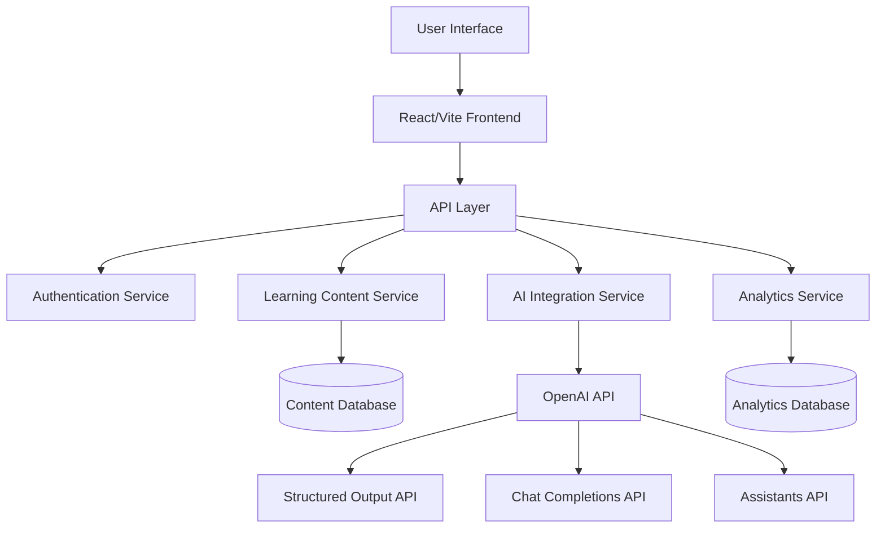
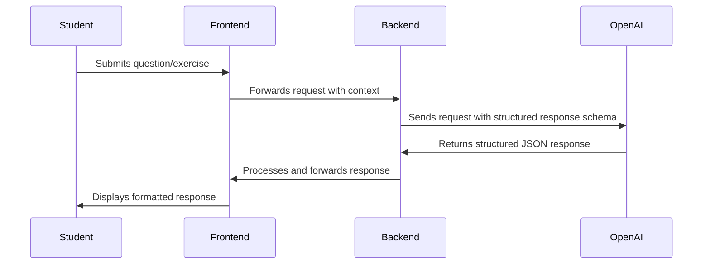
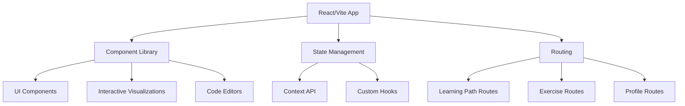
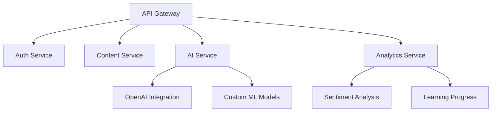
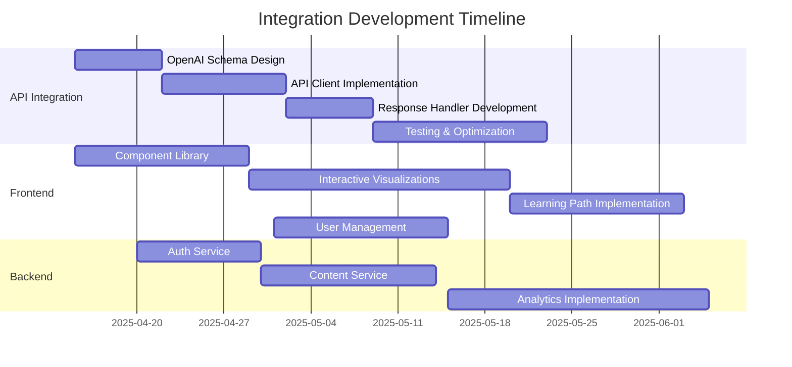

# 🔧 Monte Carlo Algorithms - Technical Implementation Plan

<div align="center">


</div>

> This document outlines the technical implementation plans for the Monte Carlo algorithms learning platform, with a focus on React/Vite frontend and OpenAI API integration.

## 🧱 Technical Architecture



## 🧠 OpenAI Structured Output API Integration

The platform will utilize OpenAI's Structured Output API to facilitate structured responses to student queries and learning assessments. This approach ensures consistent, well-formatted responses that can be easily parsed and displayed in the UI.

### Key Implementation Details

1. **Schema Definition**: We'll define JSON schemas for different response types:
   - Concept explanations
   - Step-by-step problem solutions
   - Feedback on student exercises
   - Learning path recommendations

2. **Response Validation**: All API responses will be validated against predefined schemas to ensure consistency and reliability

3. **API Integration Flow**:



### Example Schema Implementation

```json
{
  "type": "object",
  "properties": {
    "concept_explanation": {
      "type": "object",
      "properties": {
        "title": { "type": "string" },
        "summary": { "type": "string" },
        "detailed_explanation": { "type": "string" },
        "examples": { 
          "type": "array",
          "items": { "type": "string" }
        },
        "related_concepts": {
          "type": "array",
          "items": { "type": "string" }
        }
      },
      "required": ["title", "summary", "detailed_explanation"]
    }
  }
}
```

### API Configuration Parameters

| Parameter | Value | Purpose |
|-----------|-------|---------|
| `model` | `gpt-4-turbo-2024-04-09` | Latest model with structured output support |
| `response_format` | `{ "type": "json_object" }` | Enforce JSON response format |
| `temperature` | `0.2` | Lower temperature for more consistent responses |
| `seed` | `[session-specific]` | For reproducible outputs when needed |

## 🛠️ Development Infrastructure

### Frontend (React/Vite)



### Backend Services



## ✅ Technical Implementation Checklist

### OpenAI API Integration

- [ ] Set up OpenAI API account and manage keys securely
- [ ] Define JSON schemas for all response types
- [ ] Implement API client with error handling and retries
- [ ] Create middleware for request/response logging
- [ ] Develop testing framework for API responses
- [ ] Implement caching layer for common responses
- [ ] Create fallback mechanisms for API failures

### React/Vite Frontend

- [ ] Set up Vite project with TypeScript configuration
- [ ] Create component library with Storybook documentation
- [ ] Implement responsive layouts for all device sizes
- [ ] Develop interactive Monte Carlo visualizations
- [ ] Build code editor with syntax highlighting
- [ ] Implement authentication flows
- [ ] Create learning path progression system

### Development Operations

- [ ] Set up CI/CD pipeline with GitHub Actions
- [ ] Configure staging and production environments
- [ ] Implement automated testing for frontend and backend
- [ ] Create Docker containers for services
- [ ] Set up monitoring and logging infrastructure
- [ ] Implement security scanning for dependencies

## 🔄 Integration Workflow



---

<div align="center">

**Monte Carlo Algorithms - Technical Implementation Plan**  
April 2025

</div>
