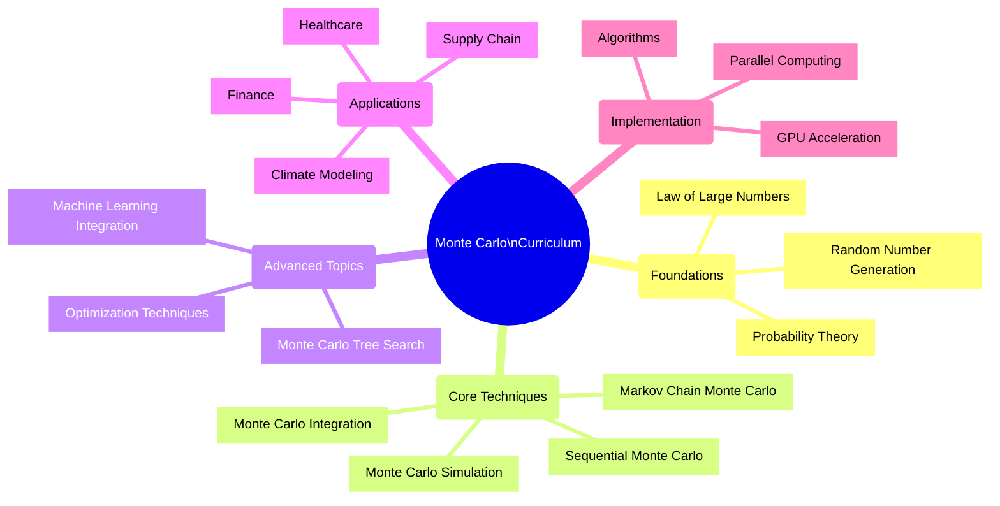
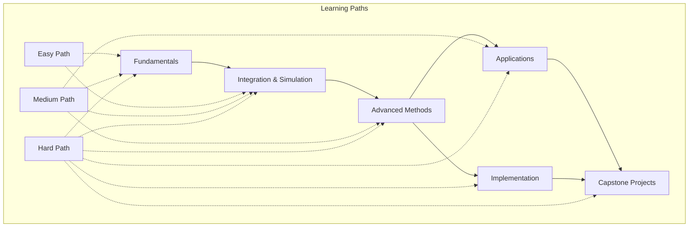
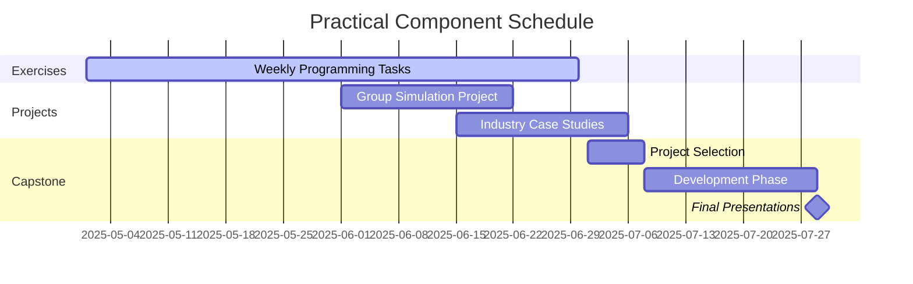

# 🎮 Monte Carlo Algorithms - Curriculum Topics

> This document provides a comprehensive outline of the core topics covered in the Monte Carlo algorithms data analytics curriculum, structured to support multiple learning paths.

## 🗺️ Topic Relationships

## 🎓 Learning Topics Progression

## 🧹 Core Topics

### 1. 🌟 **Fundamentals of Monte Carlo Methods**

| Topic | Description | Key Concepts | Difficulty |
|-------|-------------|--------------|------------|
| History | Origins and development | Manhattan Project, first applications | 🟢 |
| Probability Theory | Theoretical foundations | Random variables, distributions | 🟢🟡 |
| Random Number Generation | Creating pseudo-random sequences | PRNGs, quasi-random sequences | 🟢🟡 |
| Convergence | Theoretical guarantees | Law of large numbers, CLT | 🟡🔴 |

### 2. 📊 **Monte Carlo Integration**

| Topic | Description | Key Concepts | Difficulty |
|-------|-------------|--------------|------------|
| Basic Integration | Numerical integration basics | Sampling-based estimation | 🟢 |
| Variance Reduction | Improving efficiency | Importance sampling, control variates | 🟡 |
| Advanced Techniques | Sophisticated approaches | Stratified sampling, quasi-MC | 🟡🔴 |
| Multi-dimensional | High-dimensional problems | Curse of dimensionality, strategies | 🔴 |

### 3. 📈 **Monte Carlo Simulation**

| Topic | Description | Key Concepts | Difficulty |
|-------|-------------|--------------|------------|
| System Modeling | From reality to models | Abstraction, validation | 🟢🟡 |
| Discrete-event | Event-driven simulation | Event queues, state transitions | 🟡 |
| Time-stepping | Time-based simulation | Time advancement, accuracy | 🟡 |
| Verification | Ensuring correctness | Testing, benchmarking | 🟢🟡🔴 |

### 4. ⛰️ **Markov Chain Monte Carlo (MCMC)**

| Topic | Description | Key Concepts | Difficulty |
|-------|-------------|--------------|------------|
| Markov Chains | Stochastic processes | State transitions, ergodicity | 🟡 |
| Metropolis-Hastings | Classic MCMC algorithm | Proposal distributions, acceptance | 🟡 |
| Gibbs Sampling | Conditional sampling | Multivariate distributions | 🟡🔴 |
| Hamiltonian MC | Physics-inspired methods | Momentum, energy conservation | 🔴 |
| Diagnostics | Assessing convergence | Trace plots, effective sample size | 🟡🔴 |

### 5. 💾 **Sequential Monte Carlo Methods**

| Topic | Description | Key Concepts | Difficulty |
|-------|-------------|--------------|------------|
| Particle Filters | Sequential estimation | State-space models, filtering | 🟡🔴 |
| Sequential Importance | Adaptive sampling | Weights, resampling | 🟡🔴 |
| Resampling | Avoiding degeneracy | Systematic, stratified methods | 🟡🔴 |
| Time-series Applications | Dynamic systems | State estimation, forecasting | 🟡🔴 |

### 6. 🎮 **Monte Carlo Tree Search**

| Topic | Description | Key Concepts | Difficulty |
|-------|-------------|--------------|------------|
| Tree Construction | Building search spaces | Nodes, edges, expansion | 🟡 |
| Exploration/Exploitation | Balancing strategies | UCB, Thompson sampling | 🟡🔴 |
| UCB Algorithm | Statistical approach | Confidence bounds | 🟡🔴 |
| Game Applications | Decision making | AlphaGo, game AI | 🟡🔴 |

### 7. 🤖 **Monte Carlo in Machine Learning**

| Topic | Description | Key Concepts | Difficulty |
|-------|-------------|--------------|------------|
| Bayesian Inference | Probabilistic modeling | Prior, posterior, sampling | 🟡🔴 |
| Neural Networks | Uncertainty quantification | Dropout MC, Bayesian NNs | 🔴 |
| Reinforcement Learning | Learning through sampling | Policy evaluation, REINFORCE | 🟡🔴 |
| Deep Monte Carlo | Neural + MC integration | Neural importance sampling | 🔴 |

### 8. 🏢 **Applications in Data Analytics**

| Topic | Description | Key Concepts | Difficulty |
|-------|-------------|--------------|------------|
| Financial Applications | Risk and portfolios | VaR, option pricing | 🟢🟡 |
| Supply Chain | Resource optimization | Inventory, logistics | 🟢🟡 |
| Healthcare | Resource allocation | Patient flow, scheduling | 🟡 |
| Climate Modeling | Environmental prediction | Weather forecasting, scenarios | 🟡🔴 |
| Marketing | Customer behavior | Mix modeling, attribution | 🟢🟡 |

### 9. 🧰 **Advanced Optimization Techniques**

| Topic | Description | Key Concepts | Difficulty |
|-------|-------------|--------------|------------|
| Simulated Annealing | Thermodynamics-inspired | Temperature schedules, cooling | 🟡 |
| Cross-entropy | Rare-event simulation | Importance sampling, adaptation | 🟡🔴 |
| Evolutionary MC | Biology-inspired | Mutation, crossover, selection | 🟡🔴 |
| Nested Sampling | Bayesian computation | Prior volumes, evidence estimation | 🔴 |

### 10. 💡 **Implementation and Performance**

| Topic | Description | Key Concepts | Difficulty |
|-------|-------------|--------------|------------|
| Efficient Algorithms | Optimized implementation | Vectorization, memory usage | 🟡🔴 |
| Parallel Methods | Multi-processor approaches | Embarrassingly parallel MC | 🟡🔴 |
| GPU Acceleration | Utilizing graphics hardware | CUDA, OpenCL programming | 🔴 |
| Production Systems | Enterprise implementation | Scalability, reliability | 🟡🔴 |

## ⚙️ Practical Components

### 💻 Hands-on Components

- **Programming Exercises**: Weekly coding assignments with increasing complexity
- **Real-world Case Studies**: Analysis of industry applications
- **Group Simulation Projects**: Collaborative problem-solving
- **Industry-focused Capstone**: End-to-end implementation

## ✅ Curriculum Development Checklist

- [x] Define core topics and learning objectives
- [x] Create topic hierarchy and relationships
- [x] Map topics to appropriate difficulty levels
- [ ] Develop detailed lesson plans for each topic
- [ ] Create practical exercises and coding assignments
- [ ] Design assessment methodologies for each topic
- [ ] Prepare instructional materials and slides
- [ ] Develop interactive demonstrations
- [ ] Create reference implementations of algorithms
- [ ] Prepare instructor guides with teaching notes

---

**Legend:** 🟢 Easy Path | 🟡 Medium Path | 🔴 Hard Path

